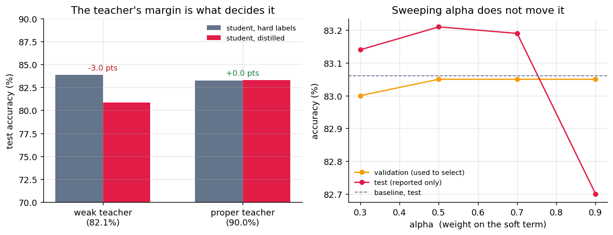
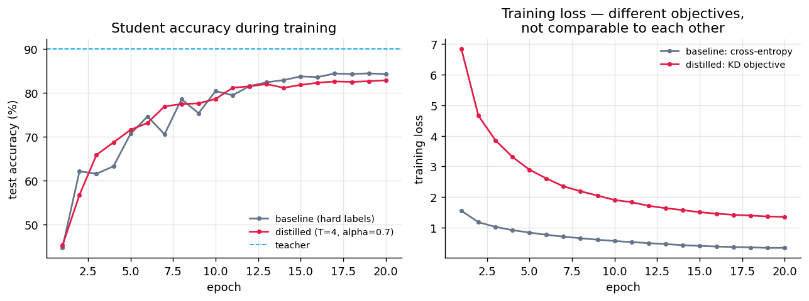
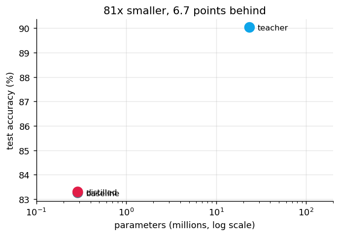

# Knowledge Distillation — ResNet-50 to a Compact CNN

Train a 289K-parameter CNN twice on the same images, with the same architecture, seed,
optimiser and schedule. Change one thing: whether it matches the hard one-hot label or the
soft class distribution a fine-tuned **ResNet-50 teacher** produces.

This repo is the honest version of that experiment. The teacher works — **90.03%** on
CIFAR-10, 81× larger than the student. The distillation gain does not:

| Model | Parameters | Test accuracy |
|---|---:|---:|
| ResNet-50 teacher (pretrained stem, 64×64 inputs) | 23,528,522 | 90.03% |
| Student CNN — baseline, hard labels | 288,746 | 83.26% |
| Student CNN — distilled (T = 4, α = 0.7) | 288,746 | 83.30% |

**+0.04 points.** Accuracy is the full 10,000-image test set, final weights,
not the best epoch — picking the best epoch is a peek at the test set.

Three experiments got to that number, and the negative ones are the interesting part.



---

## Experiment 1 — the obvious CIFAR adaptation is a trap

The standard advice for putting ResNet on CIFAR is to replace the stem: the stock 7×7
stride-2 convolution plus max-pool reduces a 32×32 image to 8×8 before the first residual
block, which throws away most of the picture. So: 3×3 stride-1 convolution, drop the
max-pool.

That is correct when training from scratch and wrong when fine-tuning a pretrained model.
The replacement stem is **randomly initialised**, so every pretrained block downstream
receives features it has never seen, and a few epochs nowhere near repairs that.

| Model | Test accuracy |
|---|---:|
| Teacher, re-stemmed ResNet-50 (3 epochs) | 82.10% |
| Student, hard labels | **83.86%** |
| Student, distilled from that teacher | 80.88% |

The teacher came out **below the student it was supposed to teach**, and distilling from it
**cost 3.0 points**. Which is exactly right: soft targets from a model worse than you are
are worse than the labels. Raw numbers in `results_weak_teacher.json`.

**Fix:** keep the pretrained stem and upsample CIFAR to 64×64 instead. Every pretrained
weight then does the job it was trained for, and layer1 runs at 16×16 instead of 32×32 —
so it is also **2.8× cheaper per step**, which paid for 8 epochs instead of 3. Teacher went
82.1% → **90.0%**.

## Experiment 2 — a good teacher was not enough

With a 90.0% teacher, 6.8 points clear of the student, distillation at the usual
T = 4, α = 0.7 moved the student by **+0.04 points**. Nothing.



The loss panel is there to be read carefully: the two curves are **different objectives**
and their absolute values say nothing about which model is better. Only the accuracy panel
answers that — and it says the two runs are on top of each other.

## Experiment 3 — is α the problem? (no)

α = 0.7 puts most of the weight on matching a distribution a 289K-parameter network can
only partly represent. Worth testing rather than assuming, so: sweep α, with a protocol
that makes the answer mean something.

* 2,000 of the 20,000 training images held out as **validation**. Nothing trains on them.
* every run — baseline and each α — trains on the same 18,000 images, same seed, same
  schedule, same augmentation.
* **α is chosen on validation accuracy.** Only then is the chosen model scored on test.
  Choosing by test accuracy and reporting that number is how a sweep becomes a lie.

| Run | Validation | Test |
|---|---:|---:|
| baseline (no KD) | 82.45% | 83.06% |
| distilled, alpha = 0.3 | 83.00% | 83.14% |
| distilled, alpha = 0.5 | 83.05% | 83.21% |
| distilled, alpha = 0.7 | 83.05% | 83.19% |
| distilled, alpha = 0.9 | 83.05% | 82.70% |

Validation picked **α = 0.5**, which scores **83.21%** on
test against the baseline's 83.06% — **+0.15 points**. Four values of α,
all within half a point of the baseline. α is not the problem.

## What is going on, then

Two things in this setup are known to break distillation, and both are true here.

**The student cannot represent the target.** The teacher's distribution over 10 classes
encodes structure a three-block CNN with a 128-wide penultimate layer has no capacity to
reproduce. Beyond some point the KL term is asking for something unreachable, and weighting
it harder (α = 0.9, the one run that was actually *worse*) just spends more of the budget on it.

**The teacher never saw what the student sees.** The cached logits were computed on the
clean image; the student trains on a random crop and a 50% horizontal flip. Roughly half
the time it is told to match the teacher's answer for a picture it is not looking at. Beyer
et al. (2022) make this the central point — distillation works when teacher and student see
*identical* views, and needs long schedules to pay off. This implementation satisfies
neither, which is the most likely reason the gain is flat.

The honest conclusion is not "distillation doesn't work". It is that **the margin between
teacher and student is necessary but not sufficient**, and this setup gets the necessary
part right and the sufficient part wrong.

## What would be tried next

1. **Consistent teaching** — run the teacher live on the same augmented view instead of
   caching clean logits. Costs a teacher forward pass per batch; the most likely fix.
2. **Longer schedules** — the distilled runs were still improving at epoch 20 while the
   baseline had plateaued. 20 epochs may simply be too few for the KD objective.
3. **More student capacity** — a wider penultimate layer, so there is something to
   distil *into*.

## Setup

**Teacher.** ImageNet-pretrained ResNet-50, stem untouched, CIFAR upsampled to
64×64. `layer1`/`layer2` frozen. 8 epochs, AdamW, cosine schedule.

**Student.** Three conv blocks (32 → 64 → 128, two 3×3 convolutions each with batch-norm),
global average pooling, one linear layer. 288,746 parameters —
1.2% of the teacher.

**Data.** A fixed random 20,000-image subset of the 50,000 CIFAR-10 training
images, drawn once with a seeded generator and reused by every run. That is a CPU budget,
not a design choice.

**Teacher logits are cached** in one forward pass before the student runs, so distillation
costs no more per epoch than baseline training.



## The objective

```
L = α · T² · KL( softmax(z_s / T) ‖ softmax(z_t / T) )  +  (1 − α) · CE(z_s, y)
```

**Why soft targets carry more than labels.** A one-hot label says an image is a cat. The
teacher says 0.82 cat, 0.11 dog, 0.005 airplane. The relative weight on the wrong classes
is a statement about which classes resemble each other.

**Why the T².** Dividing logits by T shrinks that term's gradient by roughly 1/T². Without
the correction, raising the temperature would quietly lower the learning rate on it too,
and α would stop meaning the same thing from one temperature to the next.

## Running it

```bash
pip install -r requirements.txt
python distill.py     # teacher, logit cache, both students -> runs/results.json
python sweep.py       # the alpha sweep with the validation split
```

CPU only. About two hours for `distill.py`, eighty minutes for `sweep.py` on two cores.

## Repository layout

The files that produced every number above:

```
distill.py                      teacher, logit cache, baseline and distilled students
sweep.py                        alpha sweep with held-out validation selection
knowledge_distillation.ipynb    method walkthrough and figures
results.json                    experiment 2 — the proper teacher
results_weak_teacher.json       experiment 1 — the re-stemmed teacher
sweep_results.json              experiment 3 — the alpha sweep
assets/                         figures
```

Every number in this README is read out of those three JSON files. None were typed in by hand.

An earlier modular scaffold is also kept in the repository:

```
models/teacher.py  models/student.py  utils/data.py
train_teacher.py   train_student.py   evaluate.py
```

It is worth being explicit about its status: that code was written but never run, and an
earlier version of this README quoted accuracies for it (~93% / 70% / 85%, +15 points) that
no execution had produced. Those numbers are gone. Note also that `models/teacher.py`
implements the **re-stemmed** teacher — the design experiment 1 above measures and rejects.
It is kept because the module structure is useful, not because its configuration is the one
to use.

## References

- Hinton, G., Vinyals, O., Dean, J. (2015). [Distilling the Knowledge in a Neural Network](https://arxiv.org/abs/1503.02531)
- Beyer, L., Zhai, X., Royer, A., Markeeva, L., Anil, R., Kolesnikov, A. (2022). [Knowledge Distillation: A Good Teacher is Patient and Consistent](https://arxiv.org/abs/2106.05237)
- He, K., Zhang, X., Ren, S., Sun, J. (2016). [Deep Residual Learning for Image Recognition](https://arxiv.org/abs/1512.03385)

## License

MIT
